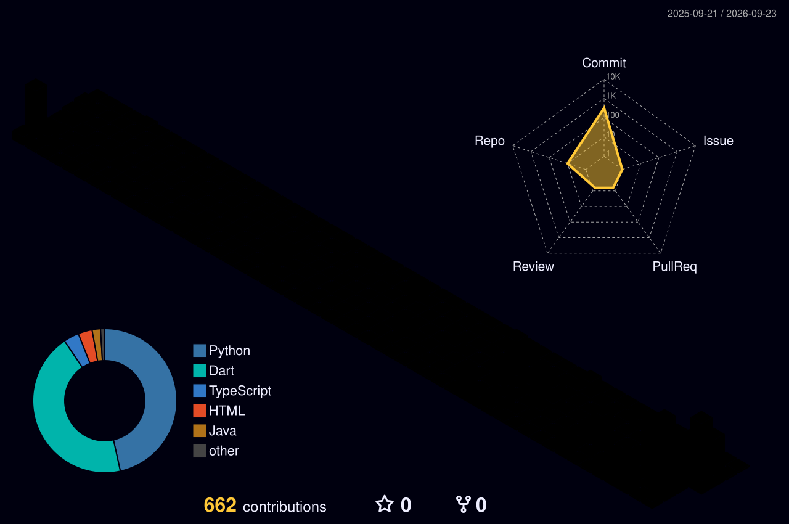

<div align="center">

```text
      ___   _______  ____  ____   ________  __    __   ________    _______  ___      ___ 
     |"  | /"     "|("  _||_ " | /"       )/" |  | "\ |"      "\  /"     "||"  \    /"  |
     ||  |(: ______)|   (  ) : |(:   \___/(:  (__)  :)(.  ___  :)(: ______) \   \  //  / 
     |:  | \/    |  (:  |  | . ) \___  \   \/      \/ |: \   ) || \/    |    \\  \/. ./  
  ___|  /  // ___)_  \\ \__/ //   __/  \\  //  __  \\ (| (___\ || // ___)_    \.    //   
 /  :|_/ )(:      "| /\\ __ //\  /" \   :)(:  (  )  :)|:       :)(:      "|    \\   /    
(_______/  \_______)(__________)(_______/  \__|  |__/ (________/  \_______)     \__/     
                                                                                         
[ RX-78-2 // DEV-UNIT-01 ]
```

<h2 data-importer="text" > 🤖 Hi, I'm Jeush !</h2>
<p align="center">
  <code>Full-Stack Engineer</code> • <code>Cloud Infrastructure</code> • <code>Security</code>
</p>

<br/>

<p align="center">
  
  
  
</p>

<pre><code>[ INITIALIZING TACTICAL PROFILE ]
> Background : Computer Science Undergraduate
> Directives : Scalable Full-Stack Engineering, Cloud Resilience & Application Security
> Trajectory : Building decoupled microservices, high-throughput pipelines, and defensive tooling</code></pre>

</div>

---

### 🧰 Armory & Capabilities

**Frontend & Backend Engineering**
<p align="left">
  
  
  
  
  
</p>

**Cloud, Containers & Security Systems**
<p align="left">
  
  
  
  
  
</p>

---

### 🚀 Featured Deployments

* **[🖥️ Real-Time System Security Dashboard](https://github.com/jeushdev/system-security-dashboard)**  
  *High-throughput machine telemetry engine streaming system health, open socket ports, process states, and threat anomalies in real time.*
  * **Architecture:** Abstract `BaseCollector` lifecycle with async polling via WebSockets, strict Pydantic v2 schemas, and dynamic threshold alert dispatching.
  * **Stack:** `FastAPI` • `Python 3.12` • `WebSockets` • `psutil` • `Pydantic v2` • `Docker` • `Chart.js`
  * **Interactive Demo:** [](https://github.com/user-attachments/assets/3afe787e-623d-43c4-88b5-324edfc17100)

* **[🛡️ Modular Application Security Engine & SOC Sandbox](https://github.com/jeushdev/modular-python-waf)**  
  *Polymorphic Layer-7 Web Application Firewall middleware accompanied by an interactive SOC incident forensics dashboard.*
  * **Architecture:** Dynamic `BaseRule` polymorphic validation contracts with pre-analysis input normalization to neutralize impedance-mismatch evasion attacks.
  * **Stack:** `Python 3` • `Flask` • `Docker` • `Regex Engine` • `Jinja2` • `Pytest`

* **[🔐 Advanced Perimeter Vault & Zero-Trust Watchdog](https://github.com/jeushdev/modular-perimeter-vault)**  
  *Zero-trust local workstation utility coupling client-side AES-256 authenticated persistence with active Layer-2 ARP intrusion sweeps.*
  * **Architecture:** Runtime constructor dependency injection keeping key derivation isolated in volatile memory prior to storage persistence.
  * **Stack:** `Python` • `Cryptography Primitives` • `AES-256-GCM` • `PBKDF2HMAC-SHA256` • `Subprocess OS Pipes`

---

### 📊 Tactical Radar & Telemetry

<p align="center">
  
  
</p>

<p align="center">
  
</p>

---

### 📡 Establish Uplink

<p align="center">
  <a href="https://www.linkedin.com/in/jeush-samuel-bantayaon-2ab40b370/">
    
  </a>
  <a href="https://github.com/jeushdev">
    
  </a>
</p>
